# :wave: Hi, I'm `Ras@ras0q`

[![i-stats]][r-stats]

[![i-trophy]][r-ryo-ma]

<!-- Refs Begin -->
[i-stats]: https://github-readme-stats-ras0q.vercel.app/api?username=ras0q&count_private=true&show_icons=true&hide_border=true
[r-stats]: https://github.com/ras0q/github-readme-stats
[i-trophy]: https://github-profile-trophy.vercel.app/?username=ras0q&column=6&row=1&no-frame=true
[r-ryo-ma]: https://github.com/ryo-ma/github-profile-trophy
<!-- Refs End -->

## :art: About `@ras0q`

- Undergraduate @ [TokyoTech](https://educ.titech.ac.jp/ict/)
  - I'm currently learning information and communications engineering
- Member @ [traP](https://trap.jp/) [SysAd](https://github.com/traPtitech)

[![i-ras0q]][r-ras0q] [![i-dotfiles]][r-dotfiles] [![i-portfolio]][r-portfolio]

<!-- Refs Begin -->
[i-ras0q]: https://github-readme-stats-ras0q.vercel.app/api/pin/?username=ras0q&repo=ras0q&show_owner=true
[r-ras0q]: https://github.com/ras0q/ras0q
[i-dotfiles]: https://github-readme-stats-ras0q.vercel.app/api/pin/?username=ras0q&repo=dotfiles&show_owner=true
[r-dotfiles]: https://github.com/ras0q/dotfiles
[i-portfolio]: https://github-readme-stats-ras0q.vercel.app/api/pin/?username=ras0q&repo=ras.place&show_owner=true
[r-portfolio]: https://github.com/ras0q/ras.place

## :tada: Recent activities

 
